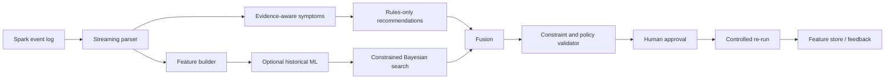

# SparkEviTune

[](LICENSE)

**SparkEviTune v1.0.0** is an evidence-aware Apache Spark configuration advisor built around Spark event logs. It combines a deterministic rules baseline with optional historical ML models, constrained Bayesian search, deterministic validation, grounded explanation, and a human-controlled feedback loop.

The SoftwareX candidate deliberately separates **observation** from **action**. Java serialization, task-duration skew, or spill can remain visible diagnostic evidence without automatically becoming a tuning recommendation.

## SoftwareX candidate status

- Spark 3.5.7 effective defaults are reconstructed when event logs omit them.
- shuffle partition sizing uses the maximum successful-stage producer-side shuffle write, not cumulative read+write traffic;
- AQE/coalescing suppresses static overpartitioning warnings when the executed task count is already modest;
- `spark.sql.adaptive.coalescePartitions.parallelismFirst=true` is reconstructed for Spark 3.5.7; the 64 MiB advisory size is treated as a heuristic starting reference rather than the partition size necessarily applied by AQE;
- `skewJoin` is conditionally active only when AQE is enabled; AQE-off/skewJoin-on search points are canonicalized;
- task-duration skew is not treated as proof of skewed join partitions;
- JavaSerializer is diagnostic context only unless workload-specific evidence justifies Kryo;
- local-mode runs preserve spill observations but suppress executor-memory escalation and optimizer executor sizing;
- feedback rows are aligned to the configuration that was actually re-run;
- ML training excludes held-out rows and requires a minimum number of **distinct scenarios**, not merely repeated rows;
- no configuration is auto-applied.

The current package test suite contains **47 passing tests**. See `TEST_REPORT.md` and `docs/softwarex_evaluation.md`.

## Architecture



## Quick start

```bash
python -m venv .venv
source .venv/bin/activate
python -m pip install --upgrade pip
pip install -e ".[ui,dev]"
pytest -q tests
```

Analyze a raw Spark event log:

```bash
sparkevitune-analyze tests/fixtures/minimal_event_log.jsonl \
  --workers 1 \
  --cores-per-worker 4 \
  --memory-per-worker-gb 8 \
  --input-size-gb 0 \
  --input-rows 1000000
```

The deterministic layer works without ML models. If no validated model exists, prediction and optimization remain unavailable rather than fabricating a result.

## Real benchmark runner

The publication protocol uses a single Spark action per workload: writing the result to Parquet. A post-write `count()` is intentionally absent.

```bash
export SPARK_MASTER='local[4]'
export SPARKEVITUNE_TOTAL_CORES='4'
export SPARKEVITUNE_TOTAL_MEMORY_GB='8'

python benchmarks/workloads/run_workload.py \
  --workload heavy_shuffle \
  --rows 1000000 \
  --architecture defaults \
  --run-dir benchmarks/results/example-heavy
```

Supported generated workloads are `etl`, `sql_joins`, `heavy_shuffle`, and `skew_join`.

## Publication evidence

Machine-readable summaries are shipped under `artifacts/softwarex_evidence/`:

- `rules_evaluation_summary.csv`
- `ml_readiness_summary.csv`
- `scenario_coverage.csv`

The current repeated evaluation shows a strong benefit when overpartitioning is genuinely observed (Heavy Shuffle and the deliberate skew-stress configuration), while SQL join cases under Spark 3.5 AQE provide important neutral results. These null results are part of the design evidence because they motivate abstention from universal serializer, skewJoin, and static-partition recommendations.

## ML data policy

Synthetic demo data can still be generated for UI/software demonstrations, but it must not be used as publication evidence.

```bash
python scripts/generate_demo_history.py --rows 250
```

For research history, use real write-only runs. `scripts/build_publication_history.py` creates a separate publication database and refuses to overwrite an existing one.

Training is gated by both row count and distinct scenario count. By default:

```text
SPARKEVITUNE_MIN_TRAINING_RUNS=20
SPARKEVITUNE_MIN_TRAINING_SCENARIOS=20
```

The current SoftwareX evidence has 81 clean real runs but only 16 distinct scenarios, so the publication trainer intentionally abstains. This release does not claim predictive ML accuracy, cost prediction, or OOM-risk calibration from that corpus.

## Core modules

| Module | Purpose |
|---|---|
| `parser.py` | streaming Spark JSON-lines parser and effective Spark 3.5 configuration |
| `detector.py` | evidence-aware symptom detection |
| `engine.py` | deterministic recommendations and abstention policy |
| `features.py` | leakage-controlled app/cluster/workload features including `input_rows` |
| `feature_store.py` | SQLite historical store |
| `ml.py` | gated model training, prediction, anomaly detection |
| `optimizer.py` | constrained Gaussian-process configuration search |
| `fusion.py` | deterministic/ML recommendation fusion |
| `validator.py` | memory/CPU/bounds/secret checks |
| `llm.py` | local retrieval and optional explanation layer |
| `pipeline.py` | end-to-end orchestration and feedback alignment |

## API and dashboard

```bash
uvicorn api.main:app --reload --port 8000
streamlit run dashboard/app.py
```

The API exposes health, analysis, report retrieval, model training/status, feedback, and explanation endpoints. The dashboard keeps rule evidence visible even when ML or an external LLM is unavailable.

## Safety and scope

- human approval is mandatory;
- no automatic deployment;
- local-mode executor sizing is not treated as a causal tuning action;
- secret-like fields are filtered before optional LLM use;
- rule compliance is not presented as proof of optimal performance;
- current repeated empirical evidence is `local[4]`; multi-worker generalization is future work.

## Reproducibility

Use the exact tagged source archive, preserve raw event logs outside the compact source distribution, and archive generated reports/checksums with any submission. The final paper source is distributed separately as an Overleaf-ready archive.

## Official repository

https://github.com/morocco-architect/SparkEviTune

**Pre-submission requirement:** publish this exact source as GitHub release `v1.0.0` and archive that release in Zenodo (or an equivalent long-term repository). Then add the immutable release URL and DOI to `CITATION.cff` and the paper's code-metadata table before submission.

## License

MIT. See `LICENSE`.

## Citation

See `CITATION.cff`. For long-term citation, create a versioned GitHub release and archival DOI from the official repository.
