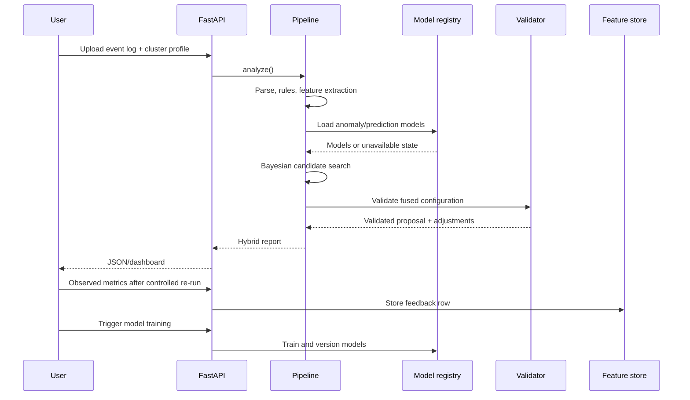

# Architecture notes

## Design principle

SparkEviTune separates four responsibilities:

1. **Observation:** parse logs and create application, cluster and workload profiles.
2. **Decision support:** deterministic rules, anomaly detection and predictive models.
3. **Optimization and safety:** bounded candidate search followed by constraint validation.
4. **Communication and learning:** report generation, optional grounded explanation and feedback storage.

## Why the rule engine remains

Historical data can be sparse, biased or drawn from a different cluster. Deterministic rules therefore remain active as a fallback and as an auditable source of known safety constraints. ML may confirm, rank or supplement rule recommendations, but a model failure never disables deterministic diagnosis.

## Data flow

## Model limitations

The default estimators operate on tabular run-level features. They do not yet model raw task sequences or Spark DAG topology. LSTM, Transformer or graph-neural-network components should only be added after a sufficiently large and diverse corpus is available.

## Submission-critical alpha.2 changes

### Exact shuffle sizing policy

The partition-sizing reference is the maximum successful task-attempt shuffle write within one successful stage attempt. Consumer-side shuffle reads are not added to producer-side writes, and separate stages are not accumulated. Arithmetic stays in bytes; MiB/GiB are presentation units only. This policy is intentionally different from the descriptive `shuffle_heavy` metric, which may summarize cumulative traffic.

### Preliminary LLM controls

The optional explanation layer redacts secret-like keys and values, neutralizes common instruction-like payloads in event-log and retrieved text, delimits all report data as untrusted, and validates the response against a structured schema. No explanation output can change the validated configuration or trigger automatic execution. These controls require adversarial empirical evaluation before any strong resistance claim.

### Real benchmark gate

The `benchmarks/` harness executes randomized repeated conditions and archives per-run outputs. It is infrastructure for future findings, not evidence itself. Publication figures must be generated from successful real runs and cross-checked against archived event logs.
